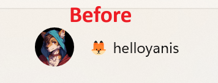

# Windows transparent account picture

Finally get rid of that black border around transparent images for your Windows account picture!



## How to use

- [Download the PowerShell script](account-picture-changer.ps1)
- In your file browser, right-click on the file you just downloaded and select "Copy file path".
- Open an administrator terminal by doing a right-click on the windows icon in your taskbar, and select `Terminal (Administrator)`
- In the terminal, type a dot `.` then right-click in the window to paste the path of the script you copied earlier. You should have a command like
```ps1
."C:\Users\you\Downloads\account-picture-changer.ps1
```
- Press enter, the script should start!

❗If you get this error when starting it :

```
You cannot run this script on the current system. For more information about running scripts and setting execution policy, see about_Execution_Policies at https://go.microsoft.com/fwlink/?LinkID=135170.
```

You need to run this command :

```ps1
Set-ExecutionPolicy -ExecutionPolicy Bypass
```

After that, run the previous command again and it should work!

## What this script does

- Downloads psexec if it's not already present on your computer, to run commands under the `SYSTEM` account
- Automatically detects your user SID to change the profile picture
- Replaces the values of the image path at `HKLM:\SOFTWARE\Microsoft\Windows\CurrentVersion\AccountPicture\Users\(your-sid)` to the path of an image you specify by creating a payload and running it with psexec to bypass the fact that the registry keys for your profile account are locked


## FAQ :

> ❓ Why does my profile picture revert to the old one after a while?

You need to disable account synchronization in the Windows settings, otherwise Windows will sync your profile picture to the one of your Microsoft account. This should not happen if you use a local account

> ❓ Why do you need the files to be run as administrator? Will I get hacked?

No! You can check both of the files with a text editor like notepad to see they do nothing wrong. You can also check the [Virustotal](https://www.virustotal.com/gui/file-analysis/MjQ3ZGE3NTJmOGY3YzlkMDk3M2JjODA4MDQyYmQxYzg6MTc2MTAzNTY2MQ==) results of the file scan

> ❓ How can I revert to the profile picture I had before?

You can set it again via the Windows settings as normal!